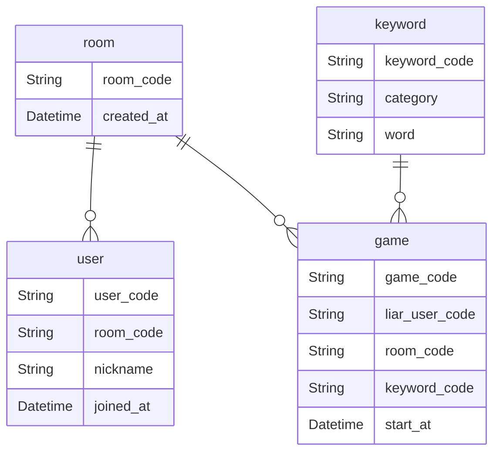

```mermaid
erDiagram
room {
   String room_code
   Datetime created_at
}
user {
   String user_code
   String room_code
   String nickname
   Datetime joined_at
}
game {
    String game_code
    String liar_user_code
    String room_code
    String keyword_code
    Datetime start_at
}
keyword {
    String keyword_code
    String category
    String word
}

room ||--o{ user : ""
room ||--o{ game : ""
keyword ||--o{ game : ""
```