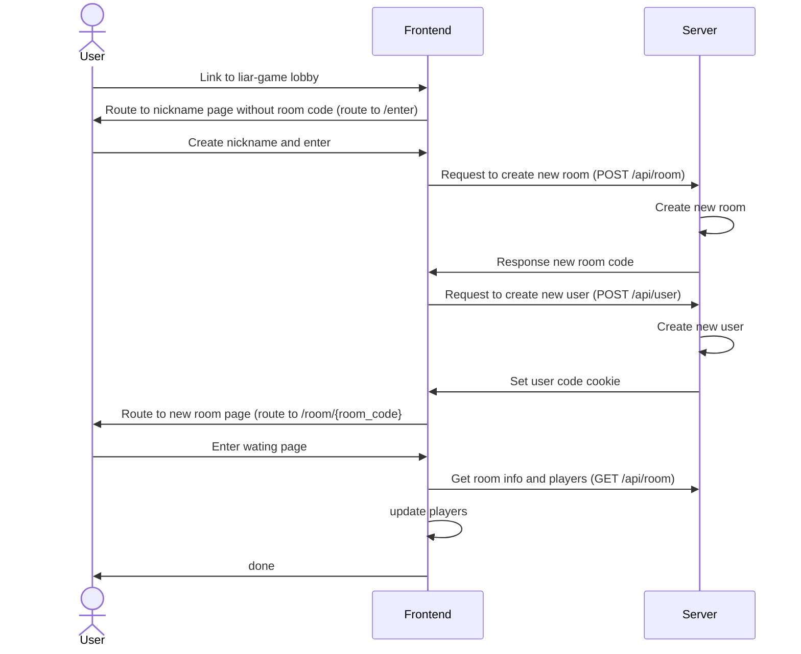

```mermaid
sequenceDiagram
actor user as User
participant fe as Frontend
participant server as Server

user ->> fe: Link to liar-game lobby 
fe ->> user: Route to nickname page without room code (route to /enter)
user ->> fe: Create nickname and enter
fe ->> server: Request to create new room (POST /api/room)
server ->> server: Create new room
server ->> fe: Response new room code
fe ->> server: Request to create new user (POST /api/user)
server ->> server: Create new user
server ->> fe: Set user code cookie
fe ->> user: Route to new room page (route to /room/{room_code}
user ->> fe: Enter wating page
fe ->> server: Get room info and players (GET /api/room)
fe ->> fe: update players
fe ->> user: done
```