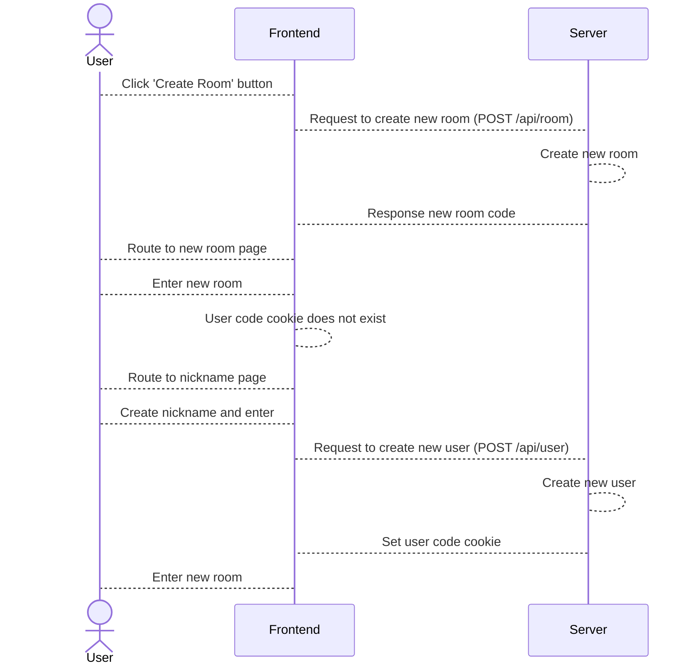

```mermaid
sequenceDiagram
actor user as User
participant fe as Frontend
participant server as Server

user --> fe: Click 'Create Room' button
fe --> server: Request to create new room (POST /api/room)
server --> server: Create new room
server --> fe: Response new room code
fe --> user: Route to new room page
user --> fe: Enter new room
fe --> fe: User code cookie does not exist 
fe --> user: Route to nickname page
user --> fe: Create nickname and enter
fe --> server: Request to create new user (POST /api/user)
server --> server: Create new user
server --> fe: Set user code cookie
fe --> user: Enter new room
```
