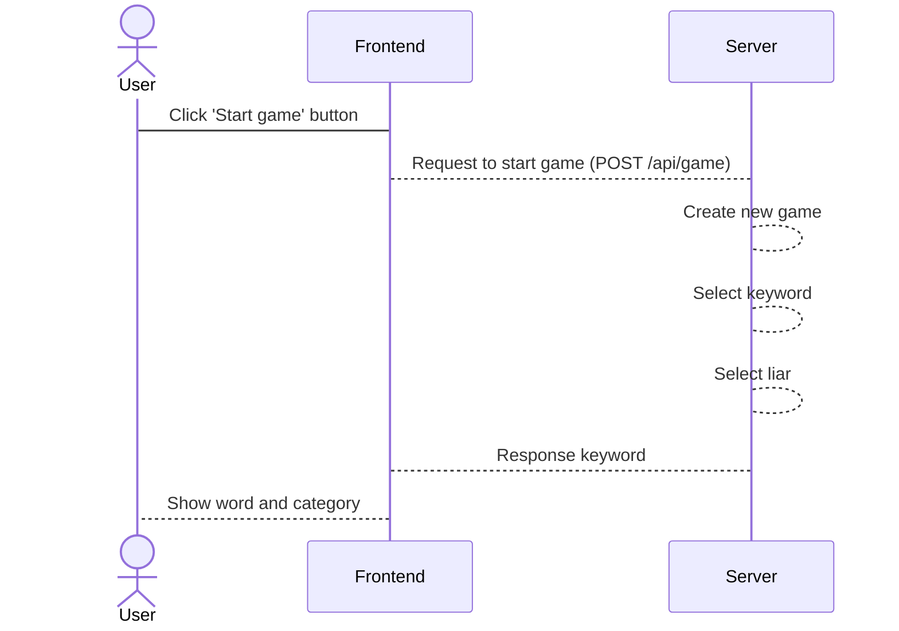

```mermaid
sequenceDiagram
actor user as User
participant fe as Frontend
participant server as Server

user -> fe: Click 'Start game' button
fe --> server: Request to start game (POST /api/game)
server --> server: Create new game
server --> server: Select keyword
server --> server: Select liar 
server --> fe: Response keyword
fe --> user: Show word and category
```
