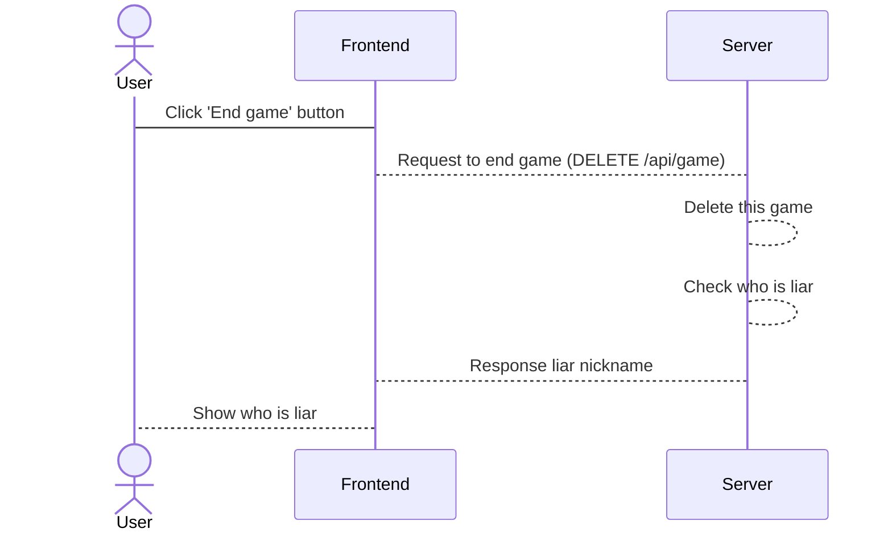

```mermaid
sequenceDiagram
actor user as User
participant fe as Frontend
participant server as Server

user -> fe: Click 'End game' button
fe --> server: Request to end game (DELETE /api/game)
server --> server: Delete this game
server --> server: Check who is liar
server --> fe: Response liar nickname
fe --> user: Show who is liar
```
