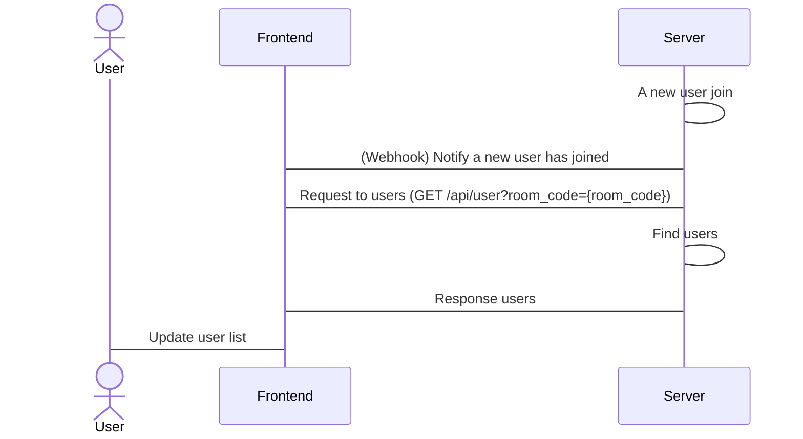

```mermaid
sequenceDiagram
actor user as User
participant fe as Frontend
participant server as Server

server -> server: A new user join
server -> fe: (Webhook) Notify a new user has joined
fe -> server: Request to users (GET /api/user?room_code={room_code})
server -> server: Find users 
server -> fe: Response users
fe -> user: Update user list
```
