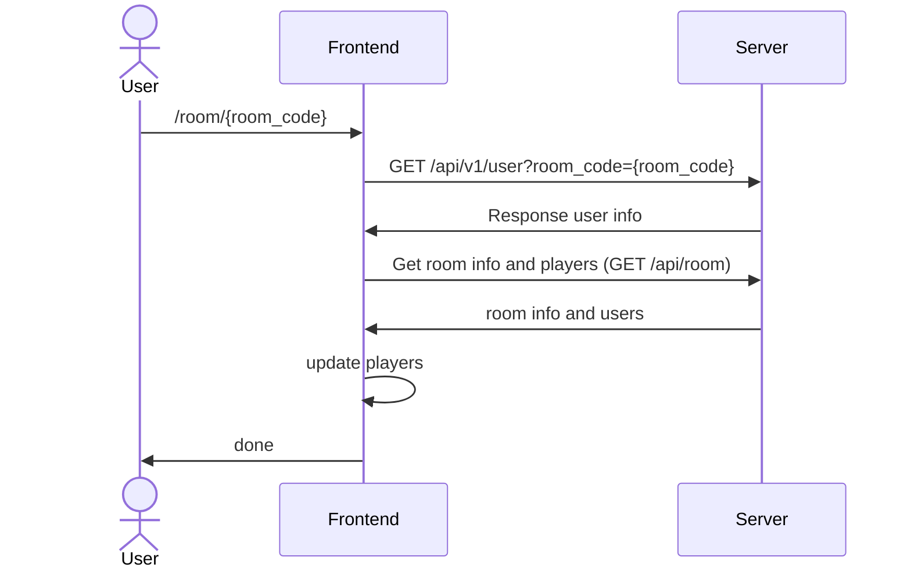

```mermaid
sequenceDiagram
actor user as User
participant fe as Frontend
participant server as Server

user ->> fe: /room/{room_code} 
fe ->> server: GET /api/v1/user?room_code={room_code}
server ->> fe: Response user info

fe ->> server: Get room info and players (GET /api/room)
server ->> fe : room info and users
fe ->> fe: update players
fe ->> user: done
```