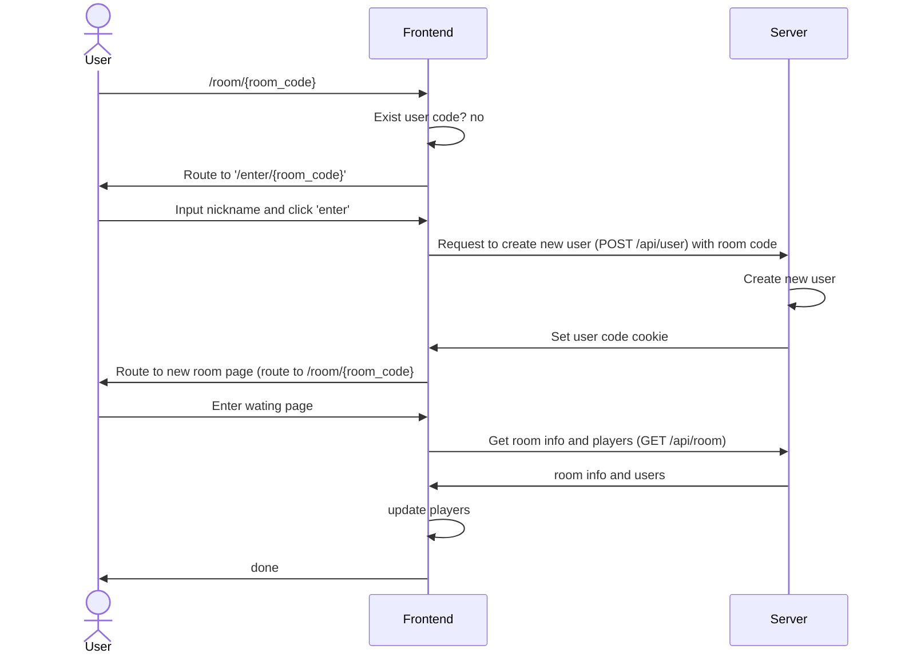

```mermaid
sequenceDiagram
actor user as User
participant fe as Frontend
participant server as Server

user ->> fe: /room/{room_code} 
fe ->> fe: Exist user code? no 
fe ->> user: Route to '/enter/{room_code}'
user ->> fe: Input nickname and click 'enter'

fe ->> server: Request to create new user (POST /api/user) with room code
server ->> server: Create new user
server ->> fe: Set user code cookie

fe ->> user: Route to new room page (route to /room/{room_code}
user ->> fe: Enter wating page
fe ->> server: Get room info and players (GET /api/room)
server ->> fe : room info and users
fe ->> fe: update players
fe ->> user: done
```