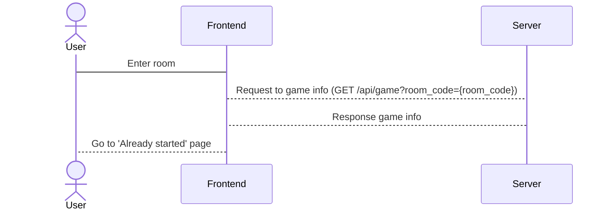

```mermaid
sequenceDiagram
actor user as User
participant fe as Frontend
participant server as Server

user -> fe: Enter room
fe --> server: Request to game info (GET /api/game?room_code={room_code})
server --> fe: Response game info
fe --> user: Go to 'Already started' page
```
