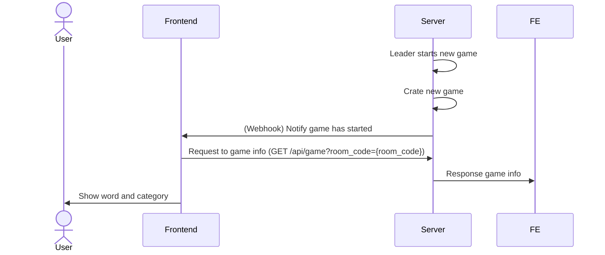

```mermaid
sequenceDiagram
actor user as User
participant fe as Frontend
participant server as Server

server ->> server: Leader starts new game
server ->> server: Crate new game
server ->> fe: (Webhook) Notify game has started
fe ->> server: Request to game info (GET /api/game?room_code={room_code})
server ->> FE: Response game info
fe ->> user: Show word and category
```
