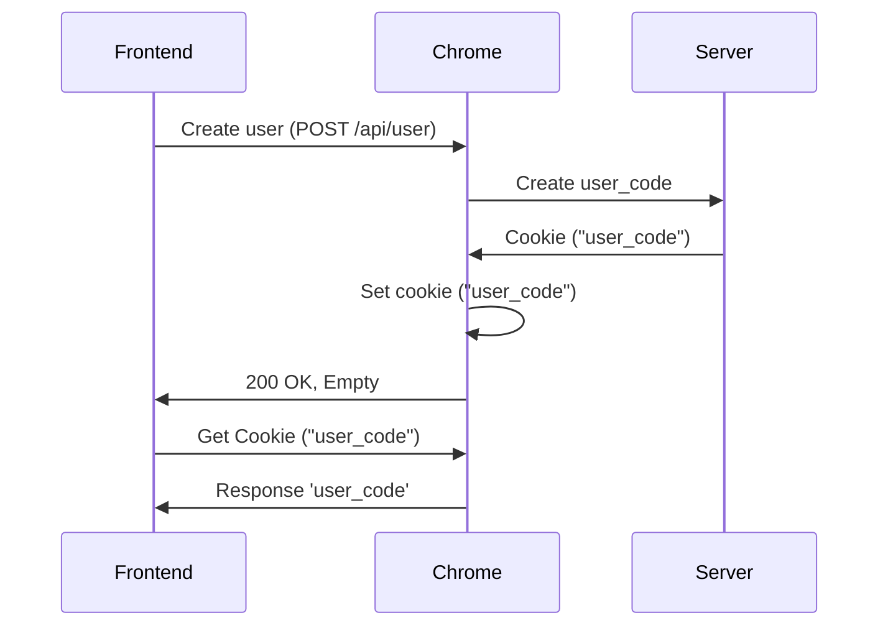

```mermaid
sequenceDiagram
participant fe as Frontend
participant browser as Chrome
participant server as Server

fe ->> browser: Create user (POST /api/user) 
browser ->> server: Create user_code 
server ->> browser: Cookie ("user_code") 
browser ->> browser: Set cookie ("user_code") 
browser ->> fe: 200 OK, Empty
fe ->> browser: Get Cookie ("user_code")
browser ->> fe: Response 'user_code'

```